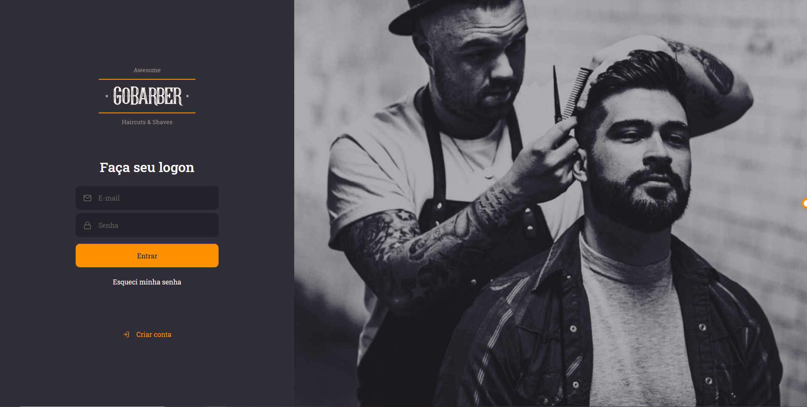

# <h1 align="center">✂️ Gobarber</h1>

 
 
 

# Gobarber Application

Cheque os seguintes links para as aplicações:

<ul>
    <li><a href="https://github.com/pdrolucasz/GoBarber/tree/master/backend">Gobarber API</a></li>
    <li><a href="https://github.com/pdrolucasz/GoBarber/tree/master/web">Gobarber Web</a></li>
    <li><a href="https://github.com/pdrolucasz/GoBarber/tree/master/mobile">Gobarber Mobile</a></li>
</ul>

#

<h3 align="center">Made with 💜 by <a href="https://www.linkedin.com/in/pedro-lucas-4b2941199/">Pedro Lucas</a></h3>