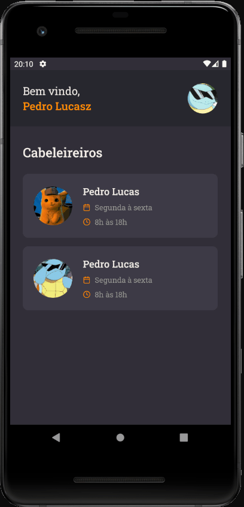

# <h1 align="center">✂️ Gobarber Mobile</h1>

 
 
 

# 🔖 Sobre

Versão Mobile da aplicação Gobarber!

Clientes podem escolher o horário de acordo com a agenda do barbeiro.

Qualquer usuário pode alterar seus dados, seja ele email, foto de perfil ou senha.

Cheque a API: <a href="https://github.com/pdrolucasz/GoBarber/tree/master/backend">GoBarber API</a>

Cheque a versão Web: <a href="https://github.com/pdrolucasz/GoBarber/tree/master/web">GoBarber Web</a>

 

# 🚀 Tecnologias

<ul>
    <li>ReactJS</li>
    <li>React Native</li>
    <li>TypeScript</li>
    <li>UnForm</li>
    <li>React Navigation</li>
    <li>React Native Vector Icons</li>
    <li>Styled Components</li>
    <li>Polished</li>
    <li>Axios</li>
    <li>Yup</li>
</ul>

 

# Instalação

<strong>Será necessário ter a API desse projeto rodando.</strong>

 

<strong>Clone o repositório e logo após acesse a pasta da api</strong>

<pre>
    git clone https://github.com/pdrolucasz/GoBarber.git
    #
    cd mobile
</pre>

<strong>Instale as dependências</strong>

<pre>
    yarn
    # ou
    npm install
</pre>

<strong>Agora basta iniciar a aplicação</strong>

<pre>
    # Caso esteja com um emulador android
    yarn android

    # Caso esteja com um emulador ios
    yarn ios
</pre>

#

<h3 align="center">Made with 💜 by <a href="https://www.linkedin.com/in/pedro-lucas-4b2941199/">Pedro Lucas</a></h3>
